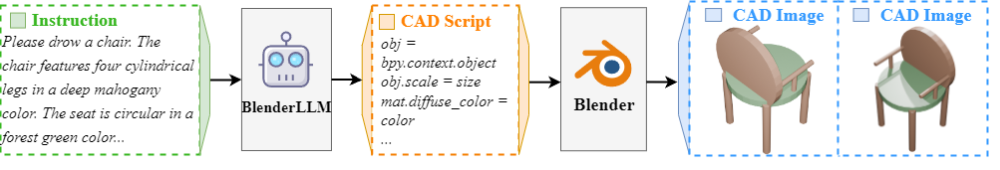
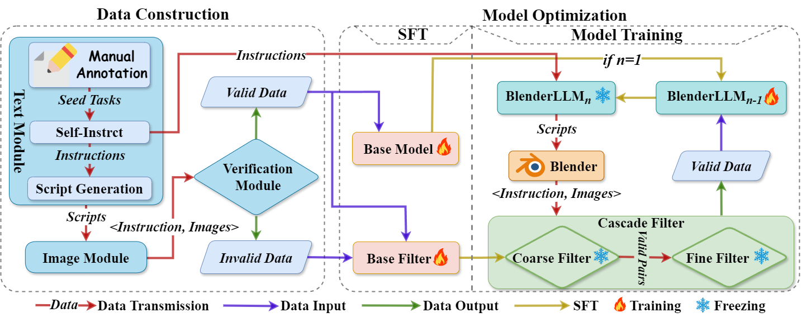
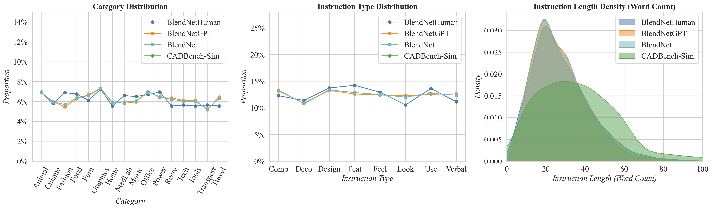
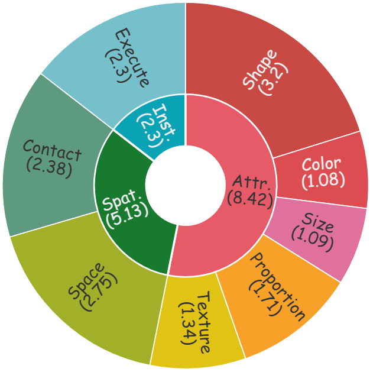

<!-- <div align="center">
    
    <span style="font-size: 24px; font-weight: bold;">BlenderLLM: Training Large Language Models for Computer-Aided Design with Self-improvement</span>
</div> -->

# BlenderLLM: Training Large Language Models for Computer-Aided Design with Self-improvement


## ✨ Latest News
<!-- - [12/11/2023]: 🎉🎉🎉 Our paper is accepted for EMNLP 2023! Check it out [here](https://aclanthology.org/2023.findings-emnlp.725/).
- [11/25/2023]: We realeased **[HuatuoGPT-II](https://github.com/FreedomIntelligence/HuatuoGPT-II)**, which achieved a new state-of-the-art in Chinese medical applications! See [here](https://github.com/FreedomIntelligence/HuatuoGPT-II).
- [09/26/2023]: Release [HuatuoGPT-reward-model](https://huggingface.co/FreedomIntelligence/HuatuoGPT-reward-model-7B). -->
- [12/17/2024]: Release the `<instruction, bpy script>` dataset: [BlenderNet](https://huggingface.co/datasets/FreedomIntelligence/BlendNet) and the benchmark: [CADBench](https://huggingface.co/datasets/FreedomIntelligence/CADBench).
- [12/17/2024]: Release the model weights of [BlenderLLM](https://huggingface.co/FreedomIntelligence/BlenderLLM).
- [12/16/2024]: Release the [tech report](https://www.arxiv.org/abs/2412.14203).

## ⚡ Introduction
<div align=center>

</div>

Welcome to the repository of **BlenderLLM**. **BlenderLLM** is a large language model specifically designed to generate CAD scripts based on user instructions. These scripts are then executed in Blender to render 3D models.


Here is a list of what has been released:

1. **BlendNet**: A high-quality dataset containing $12k$ `<instruction, CAD script>` pairs. 
2. **BlenderLLM**: A large language model fine-tuned on BlendNet based on **Qwen2.5-Coder-7B-Instruct**, designed to output CAD scripts. 
3. **CADBench**: A comprehensive benchmark for evaluating this task.
 
<div align=center>

</div>


## 💭 Motivation
- To address the challenges posed by the complexity of input forms in CAD applications. We recognize that the high threshold for use limits accessibility, and we believe that user-friendly interfaces and simplified input methods are essential to encourage wider adoption of CAD-oriented LLMs.  

- To provide high-quality, domain-specific datasets for training CAD-oriented LLMs. Building datasets that capture the intricate nuances of CAD design is critical, yet challenging. Efforts to create and share such datasets will significantly enhance the ability of LLMs to understand and perform CAD tasks effectively.  

- To ensure accessibility, local deployment, and privacy preservation through open-source CAD-oriented LLMs. By developing and releasing open-source models, we aim to democratize access to advanced tools, empower localized and secure deployments, and support diverse user needs in the CAD domain.  

- To emphasize the importance of a comprehensive evaluation framework for CAD-oriented LLMs. Establishing rigorous evaluation methodologies is vital to assess and improve model performance, ensuring robust, reliable, and practical solutions for CAD applications.


## 📚 BlendNet

### 📖 Overview

The dataset contains $12k$ samples. To balance cost savings with data quality and scale, we manually annotated $2k$ samples and used **GPT-4o** to annotate the remaining $10k$ samples.

To ensure diversity, we categorized objects into 16 types, classified instructions into 8 tones, and varied the lengths of the instructions. The figure below illustrate the diversity distribution.

<div align=center>

</div>

The figure below illustrates the complexity of tasks in the dataset, demonstrating task difficulty using the metrics—**Unit Number**, **Parameter Density**, and **Entropy**—which reflect geometric complexity, parameter intricacy, and spatial diversity.

<div align=center>

</div>

---

### 📥 Download

[Click here](https://huggingface.co/datasets/FreedomIntelligence/BlendNet) to view the **samples** and download the **BlendNet**.


## 🤖 Model

### 🔑 Model Access

| Model                | Backbone      | Link                                                                          |
|----------------------|---------------|-------------------------------------------------------------------------------|
| BlenderLLM | Qwen2.5-Coder-7B-Instruct | [Model Weights](https://huggingface.co/FreedomIntelligence/BlenderLLM) |

---

### 🚀 Deploy

Firstly, you should install all required packages:

```bash
pip install -r requirements.txt
```

⚠️ **System Requirement:**  
Make sure you have installed **Blender** and set its executable path. You can test if Blender is installed by running the following command:

```bash
blender --version
```

If Blender is not installed, download it from the [official Blender website](https://www.blender.org/download/) and ensure its executable is accessible via system paths.  

---

### 🔧 Run Instructions

🔔 **Please make sure you have downloaded our model weights.**

If you **only want to chat** with BlenderLLM, please run:

```bash
python chat.py \
    --model_name "$MODEL_NAME" \
    --prompt "$PROMPT"
```

If you want to chat with BlenderLLM **and execute scripts to render images**, please run:

```bash
python modeling.py \
    --model_name "$MODEL_NAME" \
    --prompt "$PROMPT" \
    --obj_name "$OBJ_NAME" \
    --output_folder "$OUTPUT_FOLDER" \
    --blender_executable "$BLENDER_EXECUTABLE" \
    --brightness "$BRIGHTNESS"
```

---

### 📝 Notes:
1. **`--blender_executable`**: Ensure you provide the correct path to the Blender executable, for example:  
   - On Windows: `C:\Program Files\Blender Foundation\Blender\blender.exe`  
   - On macOS/Linux: `/usr/bin/blender` or `/usr/local/bin/blender`

2. **Blender Dependency**:  
   Blender is required for executing scripts and rendering images. If you skip this, you will only be able to use the chat feature.


## 🧐 Evaluations

### 📊 Benchmark
We developed a comprehensive benchmark, **CADBench**, to evaluate the ability of LLMs to generate CAD scripts. It contains 500 simulated data samples and 200 data samples collected from online forums.

Each sample is assessed using specific multi-dimensional criteria. The figure below illustrates the dimensions of the criteria for each sample and the average number of criteria per dimension.

<div align=center>

</div>

### 📥 Download
[Click here](https://huggingface.co/datasets/FreedomIntelligence/CADBench) to view the **samples** and download the **CADBench**.


### 🧪 Benchmark  Evaluation

We utilized `GPT-4o` to evaluate LLMs on CADBench, and the evaluation results are shown in the table below.

|                             | | | **CADBench-Sim** | | | | | **CADBench-Wild** | | |
|-----------------------------|------------|------------|------------|--------------------|---------------|------------|------------|------------|--------------------|---------------|
| **Models**                  | $Attr.$↑ | $Spat.$↑ | $Inst.$↑ | $Avg.$↑          | $E_{syntax}$↓ | $Attr.$↑ | $Spat.$↑ | $Inst.$↑ | $Avg.$↑          | $E_{syntax}$↓ |
| **BlenderLLM**              | **0.846**  | **0.760**  | **0.638**  | **0.748 ± 0.085**  | **3.4%**      | **0.739**  | **0.675**  | **0.578**  | **0.664 ± 0.066**  | **3.5%**      |
| o1-Preview                  | 0.729      | 0.707      | 0.624      | 0.687 ± 0.045      | 15.6%         | 0.595      | 0.612      | 0.542      | 0.583 ± 0.030      | 17.5%         |
| GPT-4-Turbo                 | 0.658      | 0.621      | 0.488      | 0.589 ± 0.073      | 18.2%         | 0.526      | 0.541      | 0.478      | 0.515 ± 0.027      | 24.5%         |
| Claude-3.5-Sonnet           | 0.687      | 0.608      | 0.482      | 0.593 ± 0.084      | 15.6%         | 0.529      | 0.508      | 0.430      | 0.489 ± 0.043      | 26.5%         |
| GPT-4o                      | 0.623      | 0.593      | 0.479      | 0.565 ± 0.062      | 21.4%         | 0.460      | 0.466      | 0.408      | 0.444 ± 0.026      | 28.5%         |
| BlenderGPT                  | 0.574      | 0.540      | 0.444      | 0.519 ± 0.055      | 25.2%         | 0.402      | 0.425      | 0.368      | 0.398 ± 0.023      | 35.0%         |
| Gemini-1.5-Pro              | 0.535      | 0.483      | 0.387      | 0.468 ± 0.061      | 30.2%         | 0.375      | 0.404      | 0.361      | 0.380 ± 0.018      | 38.0%         |
| DeepSeek-V2.5               | 0.569      | 0.497      | 0.372      | 0.479 ± 0.081      | 25.2%         | 0.422      | 0.394      | 0.345      | 0.387 ± 0.032      | 34.0%         |
| Qwen2.5-Coder-7B-Instruct   | 0.457      | 0.352      | 0.251      | 0.353 ± 0.084      | 31.4%         | 0.354      | 0.327      | 0.250      | 0.310 ± 0.044      | 37.0%         |
| Qwen2.5                     | 0.367      | 0.274      | 0.193      | 0.278 ± 0.071      | 44.8%         | 0.220      | 0.219      | 0.170      | 0.203 ± 0.023      | 58.5%         |
| LLaMA-3.1-8B-Instruct       | 0.125      | 0.087      | 0.071      | 0.094 ± 0.023      | 76.0%         | 0.130      | 0.127      | 0.105      | 0.120 ± 0.011      | 65.5%         |
| Mistral-7B-Instruct-V0.3    | 0.015      | 0.018      | 0.015      | 0.016 ± 0.001      | 96.8%         | 0.023      | 0.031      | 0.030      | 0.028 ± 0.004      | 93.0%         |
| CodeLLaMA-7B-Instruct       | 0.005      | 0.004      | 0          | 0.003 ± 0.002      | 98.8%         | 0.009      | 0.019      | 0.015      | 0.014 ± 0.004      | 96.5%         |


<!-- ## ⚒️ Training
### Prepare the Data
You can download the SFT data from [HuatuoGPT-sft-data-v1](https://huggingface.co/datasets/FreedomIntelligence/HuatuoGPT-sft-data-v1) or buld your SFT data as the same schema.

### Training
You can train the model by:
```bash
accelerate launch \
	--config_file scripts/sft.yaml \
	--num_processes 8 \
	--num_machines 1 \
	--machine_rank 0 \
	--deepspeed_multinode_launcher standard scripts/finetune.py \
    --experiment_name HuatuoGPT \
	--model_path /path/to/your/model \
    --gradient_accumulation_steps 8 \
    --max_ckpts 3 \
    --max_seq_len 2048 \
	--data_dir /path/to/your/data \
	--output_dir ./ckpts \
	--log_dir ./train_logs \
	--n_epochs 3 \
	--train_bsz_per_gpu 2 \
	--eval_bsz_per_gpu 2 \
	--learning_rate 5e-5 \
	--eval_step -1 \
	--save_step -1 \
    --gradient_checkpointing
``` -->

## 🌱 Limitations

BlenderLLM aims to improve the efficiency and accessibility of CAD modeling tasks but has the following limitations:

1. **Focus on Basic Modeling**: It primarily handles basic CAD tasks and does not support advanced design aspects such as material properties, surface treatments, or internal structural details.

2. **Limited input Scope**: The model generates CAD scripts from text instructions but does not support direct CAD model creation or multimodal inputs, such as integrating text with images.

3. **Lack of Multi-turn Dialogue**: It cannot handle iterative, multi-turn interactions, limiting its usefulness for collaborative and interactive design refinements.


## 🙏 Acknowledgement

We are aware that our works are inspired by the following works, including but not limited to

- Qwen2.5-Coder-7B-Instruct: https://huggingface.co/Qwen/Qwen2.5-Coder-7B-Instruct
- Qwen2-VL-7B-Instruct: https://huggingface.co/Qwen/Qwen2-VL-7B-Instruct
- Self-instruct: https://github.com/yizhongw/self-instruct

Without these, nothing could happen in this repository.

## 📖 Citation
```angular2
@misc{du2024blenderllmtraininglargelanguage,
      title={BlenderLLM: Training Large Language Models for Computer-Aided Design with Self-improvement}, 
      author={Yuhao Du and Shunian Chen and Wenbo Zan and Peizhao Li and Mingxuan Wang and Dingjie Song and Bo Li and Yan Hu and Benyou Wang},
      year={2024},
      eprint={2412.14203},
      archivePrefix={arXiv},
      primaryClass={cs.HC},
      url={https://arxiv.org/abs/2412.14203}, 
}
```

We are from the School of Data Science (SDS), the Chinese University of Hong Kong, Shenzhen (CUHKSZ).

<!-- ## Star History

<a href="https://star-history.com/#FreedomIntelligence/HuatuoGPT&Date">
  <picture>
    <source media="(prefers-color-scheme: dark)" srcset="https://api.star-history.com/svg?repos=FreedomIntelligence/HuatuoGPT&type=Date&theme=dark" />
    <source media="(prefers-color-scheme: light)" srcset="https://api.star-history.com/svg?repos=FreedomIntelligence/HuatuoGPT&type=Date" />
    
  </picture>
</a> -->

## Setup

1. Install dependencies:
   ```
   pip install -r requirements.txt
   ```

2. Make sure Blender is installed on your system.

3. Set your API keys for remote models (if using OpenAI or Anthropic Claude):
   ```
   # For OpenAI models
   export OPENAI_API_KEY="your_openai_key"
   
   # For Anthropic Claude models
   export ANTHROPIC_API_KEY="your_anthropic_key"
   ```

## Usage

### Seamless Builder

The easiest way to use BlenderLLM is with the seamless builder script. This will:
1. Generate a Blender script based on your text prompt
2. Create a 3D model as an OBJ file
3. Render images of the model from multiple angles

```bash
# Using OpenAI's GPT-4
python seamless_builder.py --prompt "A simple potted plant with small leaves" 

# Using Anthropic's Claude 3.7 Sonnet
python seamless_builder.py --model_name anthropic:claude-3-7-sonnet-20240708 --prompt "A simple potted plant with small leaves"

# Show generated script and enable debug logging
python seamless_builder.py --model_name anthropic:claude-3-7-sonnet-20240708 --prompt "A steering wheel" --show_script --debug
```

### Options

```
--model_name: Model to use (default: openai:gpt-4)
  - Local model: path/to/model
  - OpenAI: openai:gpt-4
  - Anthropic: anthropic:claude-3-7-sonnet-20240708
  - Custom API: api:your-endpoint

--prompt: Text description of what to create
--obj_name: Name for output files (default: generated from prompt)
--output_folder: Where to save files (default: output/)
--blender_executable: Path to Blender (auto-detected on macOS)
--brightness: Lighting brightness (Very Bright, Bright, Medium Bright, Dark, Very Dark)
--show_script: Display the generated script before execution
--skip_render: Only generate OBJ file without rendering images
--debug: Enable debug logging
--keep_temp_scripts: Keep temporary scripts for debugging purposes
```

## Supported Models

### Local Models
- Any local model supported by Hugging Face Transformers

### Remote API Models
- OpenAI: gpt-3.5-turbo, gpt-4, gpt-4-turbo, etc.
- Anthropic Claude: 
  - claude-3-opus-20240229
  - claude-3-sonnet-20240229
  - claude-3-haiku-20240307
  - claude-3-5-sonnet-20240620
  - claude-3-7-sonnet-20240708 (recommended for best results)

## Example

```bash
python seamless_builder.py --model_name anthropic:claude-3-7-sonnet-20240708 --prompt "A simple potted plant with small leaves"
```

This will:
1. Generate a Blender Python script
2. Create a 3D model of a potted plant
3. Save the model as an OBJ file
4. Render images from multiple angles

Output files will be in `output/a_simple_potted/`
